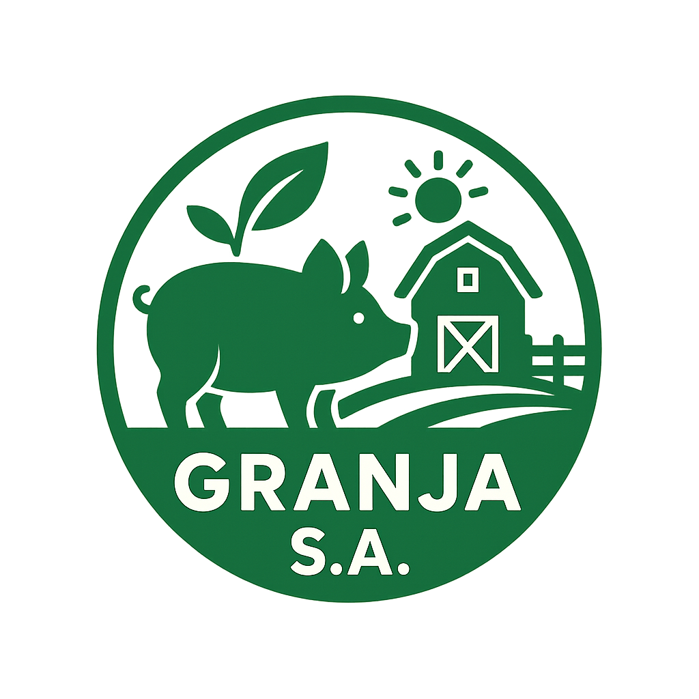
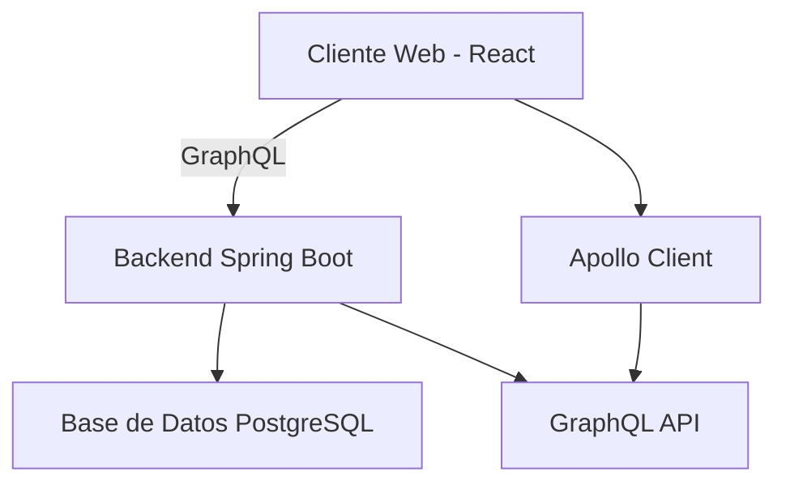
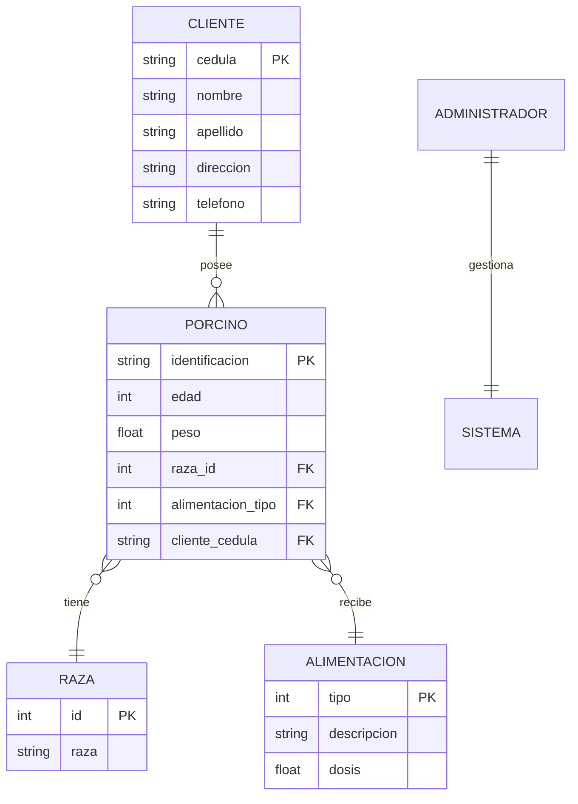

# 🐷 Sistema de Gestión de Granja Porcina - Full Stack

<div align="center">
  
  
  **Politécnico Colombiano Jaime Isaza Cadavid**  
  Programación Distribuida y Paralela - 2025
</div>

## 📖 Descripción General

Sistema completo de gestión para granjas porcinas que integra un backend robusto con Spring Boot y GraphQL junto con una interfaz moderna desarrollada en React. Permite administrar de manera eficiente porcinos, clientes, alimentación, razas y generar reportes detallados.

## 🚀 Características Principales

- 🐖 **Gestión de Porcinos**: CRUD completo con seguimiento de edad, peso, raza y alimentación
- 👥 **Administración de Clientes**: Registro y gestión de propietarios de porcinos
- 🌾 **Control de Alimentación**: Tipos de alimentación y dosis recomendadas
- 🧬 **Catálogo de Razas**: Gestión de diferentes razas porcinas
- 📊 **Sistema de Reportes**: Reportes generales y filtrados por cliente con exportación CSV
- 🔐 **Autenticación**: Sistema de login para administradores
- 📱 **Diseño Responsivo**: Interfaz adaptable a dispositivos móviles y desktop

## 🏗️ Arquitectura del Sistema



## 📁 Estructura del Proyecto

```
Parcial-1/
├── CRUD/                        # Backend Spring Boot
│   ├── src/
│   │   ├── main/
│   │   │   ├── java/           # Código fuente Java
│   │   │   └── resources/      # Recursos y configuración
│   │   └── test/               # Pruebas unitarias
│   ├── pom.xml                 # Dependencias Maven
│   └── README.md               # Documentación del backend
│
└── granja-frontend/            # Frontend React
    ├── public/
    │   └── assets/             # Imágenes y recursos estáticos
    ├── src/
    │   ├── components/         # Componentes reutilizables
    │   ├── pages/              # Páginas de la aplicación
    │   ├── graphql/            # Queries y mutations
    │   ├── context/            # Context API
    │   └── types/              # Tipos TypeScript
    ├── package.json            # Dependencias npm
    └── README.md               # Documentación del frontend
```

## 🛠️ Stack Tecnológico

### Backend
- **Java 17** con **Spring Boot 3.5.6**
- **GraphQL** para API flexible
- **Spring Data JPA** con **PostgreSQL**
- **Maven** para gestión de dependencias

### Frontend
- **React 18** con **TypeScript**
- **Apollo Client** para GraphQL
- **Tailwind CSS** para estilos
- **Recharts** para visualizaciones
- **React Router** para navegación

## 🚀 Guía de Instalación Rápida

### Prerequisitos
- Java 17+
- Node.js 14+
- PostgreSQL 12+
- Git

### 1️⃣ Clonar el Repositorio
```bash
git clone https://github.com/DiegoAM13/Parcial-1.git
cd Parcial-1
```

### 2️⃣ Configurar Base de Datos
```sql
-- En PostgreSQL
CREATE DATABASE Granja;
```

### 3️⃣ Configurar y Ejecutar Backend
```bash
cd CRUD

# Editar credenciales de postgresql en src/main/resources/application.properties
# spring.datasource.username=tu_usuario
# spring.datasource.password=tu_password

# Ejecutar
mvn spring-boot:run
```
El backend estará disponible en `http://localhost:8080`

### 4️⃣ Configurar y Ejecutar Frontend
```bash
cd ../granja-frontend

# Instalar dependencias
npm install

# Ejecutar
npm start
```
El frontend estará disponible en `http://localhost:3000`

## 📸 Capturas de Pantalla

### Dashboard Principal
- Métricas en tiempo real
- Gráficos de distribución
- Acciones rápidas

### Gestión de Porcinos
- Tabla con filtros avanzados
- Formularios de registro/edición
- Vista detallada

### Sistema de Reportes
- Reportes generales y filtrados
- Exportación a CSV
- Estadísticas agregadas

## 📊 Modelo de Datos



## 🔐 Credenciales por Defecto

### Administrador
- **Usuario**: admin
- **Contraseña encriptada**: $2a$10$XsgCqXkL8QZz5Y5J3oVUzO1e5xXv1nLJQ5vL5Y3Z1QeWX8vK5XHm

### Base de Datos
- **Usuario**: postgres
- **Contraseña**: (configurar en application.properties)

## 📝 Uso del Sistema

1. **Iniciar sesión** con las credenciales de administrador
2. **Navegar** por las diferentes secciones usando el menú lateral
3. **Gestionar** porcinos, clientes, alimentación y razas
4. **Generar reportes** y exportarlos según necesidad
5. **Cerrar sesión** al finalizar

## 🐛 Solución de Problemas

### Frontend no se conecta al Backend
- Verificar que el backend esté ejecutándose en puerto 8080
- Revisar configuración CORS en application.properties
- Comprobar URL en `src/graphql/apollo-client.ts`

### Error de Base de Datos
- Verificar que PostgreSQL esté activo
- Confirmar credenciales correctas
- Revisar que la base de datos "Granja" exista

### Problemas de Compilación
- Frontend: `npm install` para reinstalar dependencias
- Backend: `mvn clean install` para limpiar y recompilar

## 📚 Documentación Adicional

- [README Backend](./CRUD/README.md) - Detalles del API GraphQL
- [README Frontend](./granja-frontend/README.md) - Componentes y estructura React
- [GraphQL Schema](./CRUD/src/main/resources/graphql/schema.graphqls) - Esquema completo

## 👥 Equipo de Desarrollo

<table>
  <tr>
    <td align="center">
      <a href="https://github.com/DiegoAM13">
        <strong>Diego Mejía</strong>
      </a>
      <br>Desarrollador Full Stack
    </td>
    <td align="center">
      <a href="https://github.com/EstivenUribe">
        <strong>Rafael Uribe</strong>
      </a>
      <br>Desarrollador Full Stack
    </td>
  </tr>
</table>

**Profesor Guía**: [Hernando Recamán Chaux](https://github.com/hrecaman)

## 🎓 Información Académica

- **Institución**: Politécnico Colombiano Jaime Isaza Cadavid
- **Materia**: Programación Distribuida y Paralela
- **Parcial**: Primero
- **Año**: 2025

## 📄 Licencia

Este proyecto es de carácter académico y está desarrollado para el Politécnico Colombiano Jaime Isaza Cadavid.

---

<div align="center">
  <strong>© 2025 - Sistema de Gestión de Granja Porcina</strong>
  <br>
  Desarrollado por Diego Mejía y Rafael Uribe para el Politécnico Colombiano Jaime Isaza Cadavid
</div>
